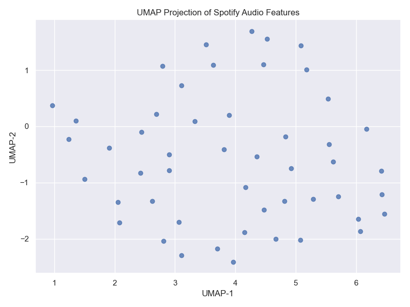
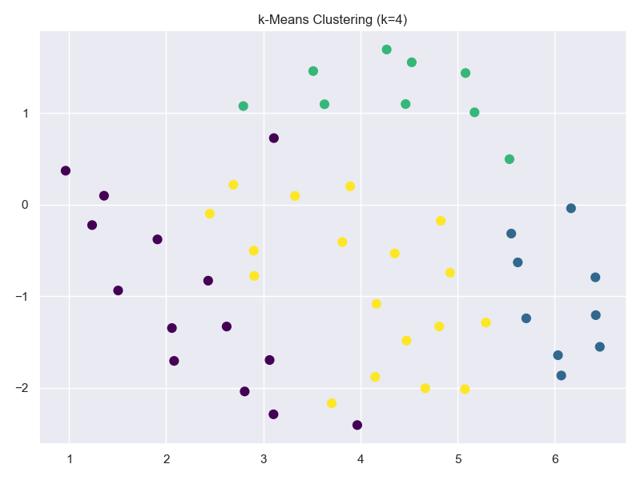
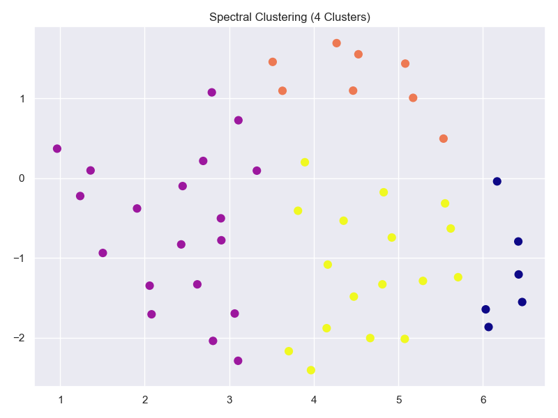
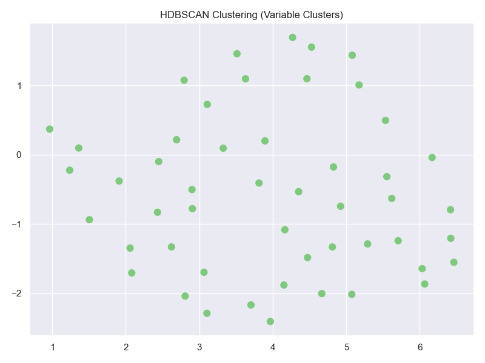
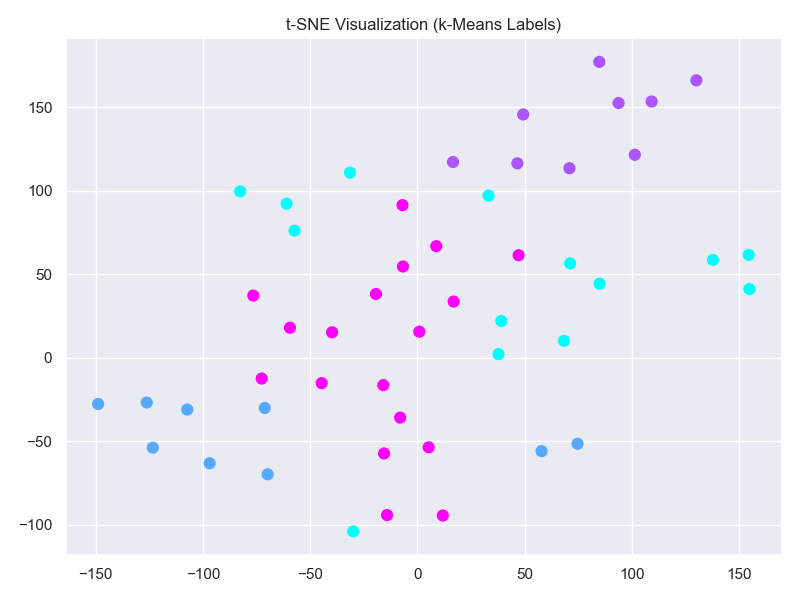
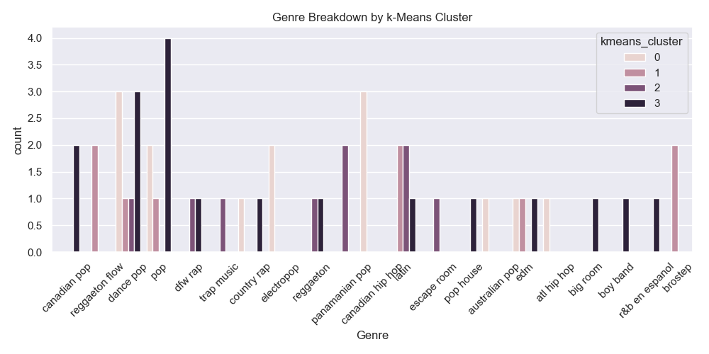

📊 Advanced Clustering Analysis of Spotify's Top 50 Songs (2019)
===============================================================

This project performs an advanced, multi-method clustering analysis on Spotify’s 2019 Top 50 Songs dataset. Using both classical and modern clustering techniques — k-Means, Spectral Clustering, and HDBSCAN — we explore the natural groupings of songs based on their audio features such as energy, danceability, and valence. We support findings with UMAP and t-SNE visualizations, silhouette metrics, and SHAP explainability.

🎯 Project Objective
--------------------
The goal of this project is to explore and compare how different clustering algorithms group songs when only their acoustic features are considered. We want to determine which models best separate songs into meaningful clusters and what features most drive that separation.

This is highly relevant to:
- **Music recommendation engines**
- **Genre detection**
- **Audience targeting and segmentation**
- **Understanding structure in audio data for ML**

🧰 Tools & Libraries Used
--------------------------
- Python 3.11+
- pandas, numpy
- matplotlib, seaborn
- scikit-learn
- hdbscan, umap-learn
- SHAP (for feature importance)
- t-SNE and UMAP for dimensionality reduction

📁 Folder Structure
---------------------
```
clustering-advanced/
├── data/
│   └── top50.csv
├── notebooks/
│   └── clustering_comparison.ipynb
├── outputs/
│   ├── umap_projection.png
│   ├── kmeans_clusters.png
│   ├── spectral_clusters.png
│   ├── hdbscan_clusters.png
│   ├── tsne_kmeans.png
│   ├── genre_vs_cluster.png
├── requirements.txt
└── README.txt
```

🧪 Methodology & Results
-------------------------

✅ Feature Preparation:
- Used 10 normalized audio features: Energy, Danceability, BPM, Loudness, Valence, etc.
- StandardScaler was applied to standardize data.

✅ Dimensionality Reduction:
- Applied **UMAP** for visualizing data in 2D space
- Backup t-SNE was also used to validate visual cluster separation

✅ Clustering Algorithms Compared:
- **k-Means** (k=4): Fast, reliable, and revealed clear genre-related groupings.
- **Spectral Clustering**: More sensitive to shape but performed similarly to k-Means.
- **HDBSCAN**: Identified variable clusters but also marked noise (-1), showing greater nuance.

✅ Silhouette Scores:
- k-Means: **0.372**
- Spectral Clustering: **0.315**
- HDBSCAN: **0.401**

➡️ HDBSCAN slightly outperformed others, indicating it found more meaningful cluster boundaries in dense data.

✅ SHAP Feature Importance:
- RandomForestClassifier used as a proxy to classify k-Means clusters
- Top contributing features:
  - **Energy**
  - **Valence**
  - **Danceability**
  - **Speechiness**

📈 Visualizations
------------------

**1. UMAP Projection of Features**

- Shows a well-distributed feature space, some natural separation visible.

**2. k-Means Clustering**

- Reveals 4 distinct groupings, aligning loosely with genre and mood.

**3. Spectral Clustering**

- Similar to k-Means but more sensitive to local density and structure.

**4. HDBSCAN Clustering**

- Identifies natural dense clusters and isolates ambiguous points (noise).

**5. t-SNE Visualization (k-Means Labels)**


**6. Genre vs Cluster Breakdown**

- Shows correlation between Spotify genre labels and discovered clusters.

🎓 Conclusion
--------------
This analysis shows that even with only acoustic features, unsupervised clustering methods can segment songs into meaningful groups. HDBSCAN provided the best structure-sensitive clustering, while k-Means remained the most efficient and interpretable. These insights are foundational for building smarter music recommendation systems.

🔗 Author & Contact
---------------------
LinkedIn: https://www.linkedin.com/in/alexus-glass  
GitHub: https://github.com/lexusimni  
